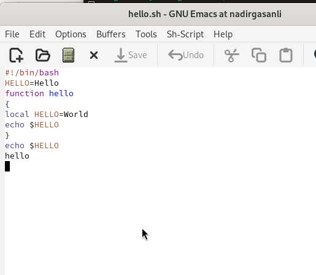
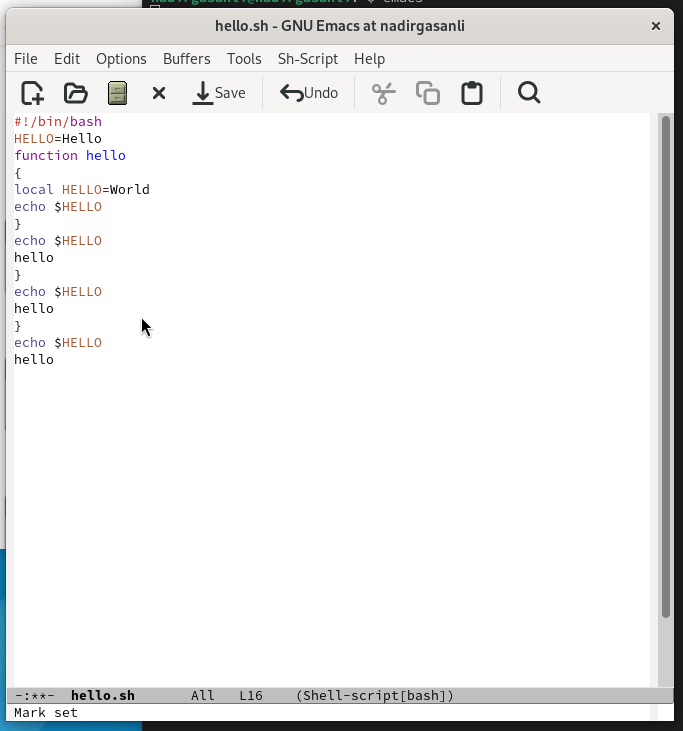
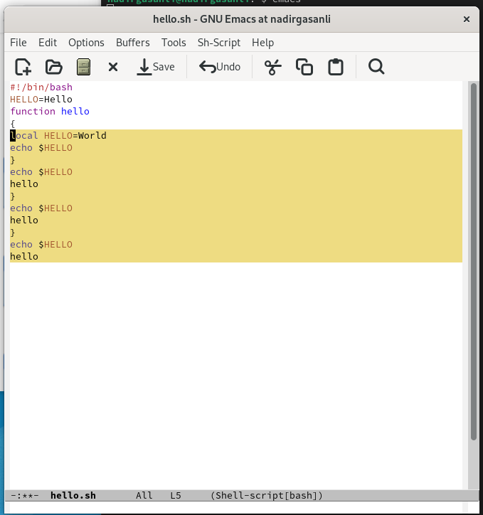
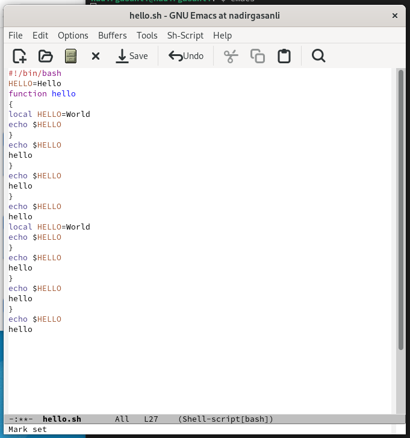
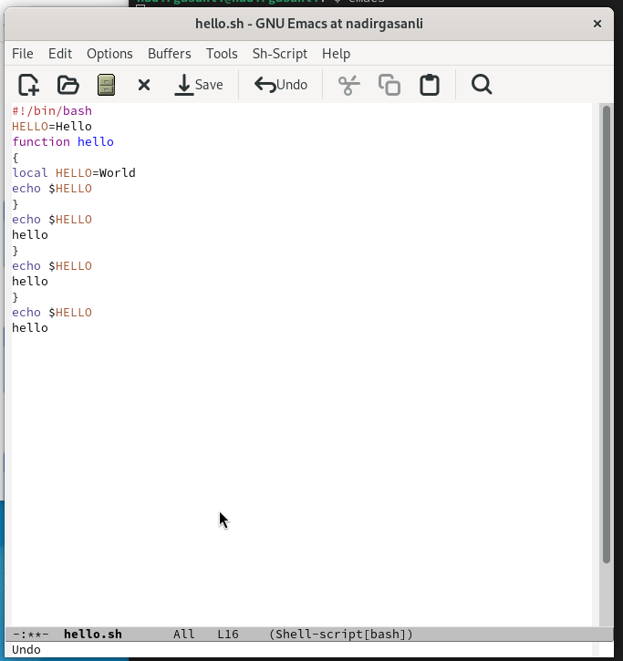
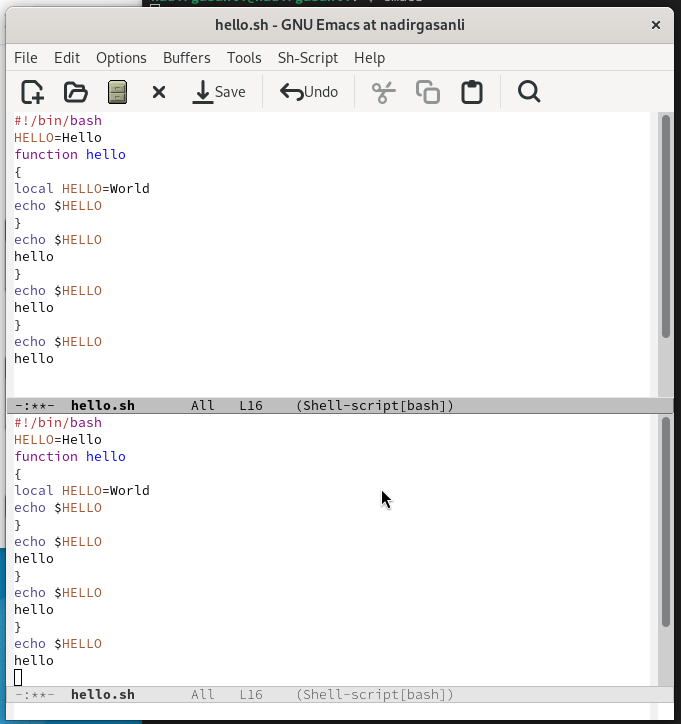
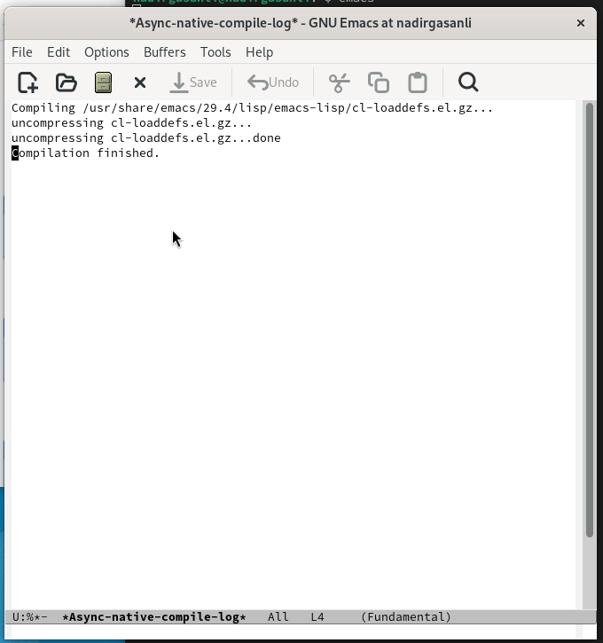
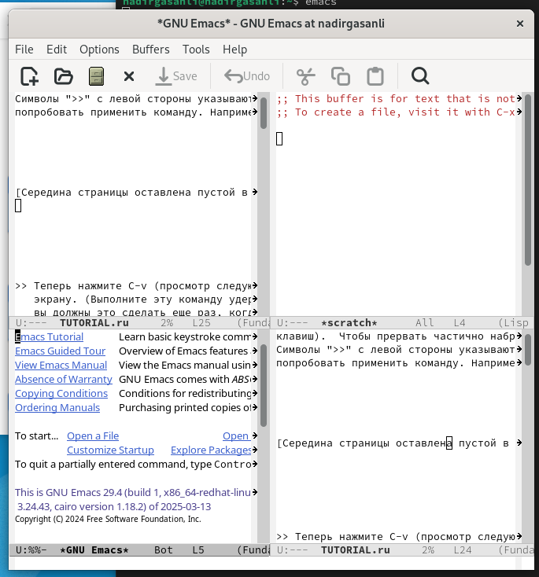
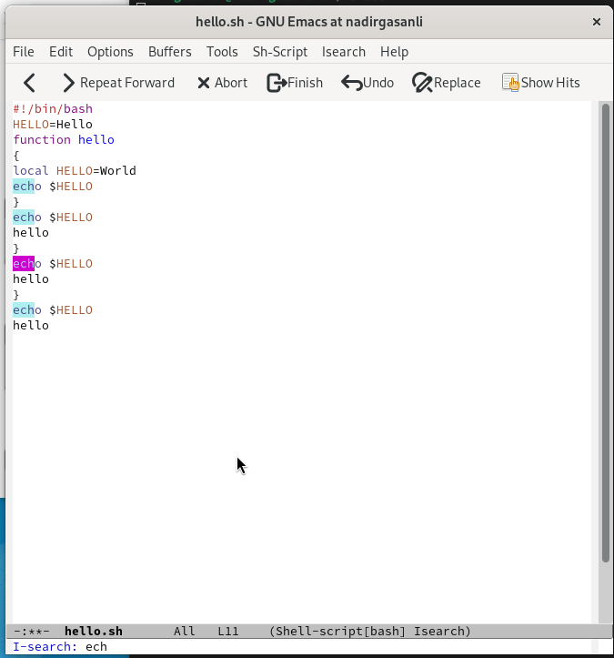

---
## Front matter
title: "Отчёт по лабораторной работе №11"
subtitle: "Редактор Emacs"
author: "Надир Гасанли"

## Generic otions
lang: ru-RU
toc-title: "Содержание"

## Bibliography
bibliography: bib/cite.bib
csl: pandoc/csl/gost-r-7-0-5-2008-numeric.csl

## Pdf output format
toc: true # Table of contents
toc-depth: 2
lof: true # List of figures
lot: true # List of tables
fontsize: 12pt
linestretch: 1.5
papersize: a4
documentclass: scrreprt
## I18n polyglossia
polyglossia-lang:
  name: russian
  options:
	- spelling=modern
	- babelshorthands=true
polyglossia-otherlangs:
  name: english
## I18n babel
babel-lang: russian
babel-otherlangs: english
## Fonts
mainfont: IBM Plex Serif
romanfont: IBM Plex Serif
sansfont: IBM Plex Sans
monofont: IBM Plex Mono
mathfont: STIX Two Math
mainfontoptions: Ligatures=Common,Ligatures=TeX,Scale=0.94
romanfontoptions: Ligatures=Common,Ligatures=TeX,Scale=0.94
sansfontoptions: Ligatures=Common,Ligatures=TeX,Scale=MatchLowercase,Scale=0.94
monofontoptions: Scale=MatchLowercase,Scale=0.94,FakeStretch=0.9
mathfontoptions:
## Biblatex
biblatex: true
biblio-style: "gost-numeric"
biblatexoptions:
  - parentracker=true
  - backend=biber
  - hyperref=auto
  - language=auto
  - autolang=other*
  - citestyle=gost-numeric
## Pandoc-crossref LaTeX customization
figureTitle: "Рис."
tableTitle: "Таблица"
listingTitle: "Листинг"
lofTitle: "Список иллюстраций"
lotTitle: "Список таблиц"
lolTitle: "Листинги"
## Misc options
indent: true
header-includes:
  - \usepackage{indentfirst}
  - \usepackage{float} # keep figures where there are in the text
  - \floatplacement{figure}{H} # keep figures where there are in the text
---

# Цель работы

Познакомиться с операционной системой Linux. Получить практические навыки работы с редактором Emacs. 

# Выполнение лабораторной работы

1. Откроем Emacs. 

{ #fig:001 width=70% height=70% }

2. Создадим файл lab07.sh с помощью комбинации Ctrl-x Ctrl-f и наберем текст из задания в ново созданный файл.  

{ #fig:002 width=70% height=70% }

3. Сохраним файл с помощью комбинации Ctrl-x s. 
Проделаем с текстом стандартные процедуры редактирования, 
каждое действие осуществляется комбинациями клавиш. 
Вырежем командой Ctrl-w. целую строку. 
Вставим эту строку в конец файла командой Ctrl-y.  

{ #fig:003 width=70% height=70% }

4. Выделим область текста командой  Ctrl-space. 

{ #fig:004 width=70% height=70% }

5. Скопируем область в буфер обмена командой alt-w. 
Вставим область в конец файла.

{ #fig:005 width=70% height=70% }

6. Вновь выделим эту область и на этот раз 
вырежем её командой Ctrl-w. 

{ #fig:006 width=70% height=70% }

7. Отменим последнее действие командой Ctrl-x u. 

8. Научимся использовать команды по перемещению курсора. 
 
 - Переместим курсор в начало строки командой Ctrl-a. 
 
 - Переместим курсор в курсор строки командой Ctrl-e. 
 
 - Переместим курсор в начало буфера Alt-<. 
 
 - Переместим курсор в конец буфера Alt->.

9. Управление буферами. Введем Ctrl-x 2.

{ #fig:007 width=70% height=70% }

10. Переместим вновь открытое окно Ctrl-x   со списком открытых буферов и переключимся на другой буфер. 

{ #fig:008 width=70% height=70% }

11.  Закроем это окно командой Ctrl-x 0.

{ #fig:009 width=70% height=70% }

12. Теперь вновь переключимся между буферами, но уже без вывода их списка на экран Ctrl-x b. 

{ #fig:010 width=70% height=70% }

13. Поделим фрейм на 4 части: разделитм фрейм на два окна по вертикали Ctrl-x 3, а затем каждое из этих окон на две части по горизонтали Ctrl-x 2. 
В каждом из четырёх созданных окон откроем новый буфер (файл).

{ #fig:011 width=70% height=70% }

14. Переключимся в режим поиска Ctrl-s  и найдем несколько слов, присутствующих в тексте. Выйдем из режима поиска, нажав Ctrl-g. 
Перейдем в режим поиска и замены Alt-Shift %, введем текст, который следует найти и заменить, для замены нажмем Enter. После этого нажмем ! для подтверждения замены.
Если мы хотим заменить конкретные слова то мы их выделяем и нажимаем Enter. Если все то ! 
Испробуем другой режим поиска, нажав Alt-s .  
От обычного режима отличается тем, что находит не фрагмент текста, а файл.

{ #fig:012 width=70% height=70% }

# Вывод

 В данной работе мы познакомились с еще одним редактором операционной системой Linux. Получили практические навыки работы с редактором Emacs.

# Контрольные вопросы

Контрольные вопросы:

1. Кратко охарактеризуйте редактор emacs. 
Ответ: Emacs представляет собой мощный экранный редактор текста, написанный на языке высокого уровня Elisp. 

2. Какие особенности данного редактора могут сделать его сложным для освоения новичком? 
Ответ: Сложным освоение данной программы для новичка  может сделать незнание комбинации клавиш или английского. 

3. Своими словами опишите, что такое буфер и окно в терминологии emacs’а 
Ответ: Моими словами буфер это динамическая память, а окно- то, что мы видим 

4. Можно ли открыть больше 10 буферов в одном окне? 
Ответ: Можно если нет ограничений на систему. 

5. Какие буферы создаются по умолчанию при запуске emacs? 
Ответ: Буферы, которые открываются по умолчанию: GNU Emacs, scratch, Messages, Quail Completions 

6. Какие клавиши вы нажмёте, чтобы ввести следующую комбинацию C-c | и C-c C-|? 
Ответ: Сtrl+c, Shift+\ и Ctrl+c Ctrl+\ 

7. . Как поделить текущее окно на две части? 
Ответ: Нажать   C-x 3, или  C-x 2. 

8. В каком файле хранятся настройки редактора emacs? 
Ответ: Настройки хранятся в файле ~/.emacs. 

9. Какую функцию выполняет клавиша Backspace и можно ли её переназначить? 
Ответ: Перемещение курсора 

10. Какой редактор вам показался удобнее в работе vi или emacs? Поясните почему. 
Ответ: Редактор emacs ,потому что на нем можно работать сразу с несколькими файлами. 